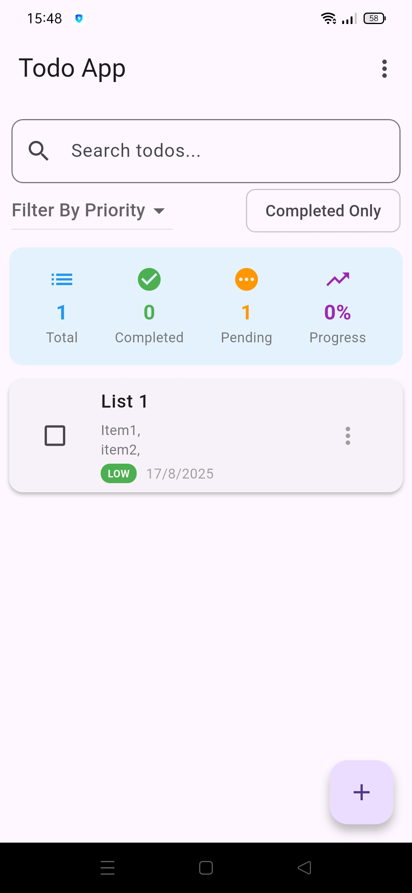
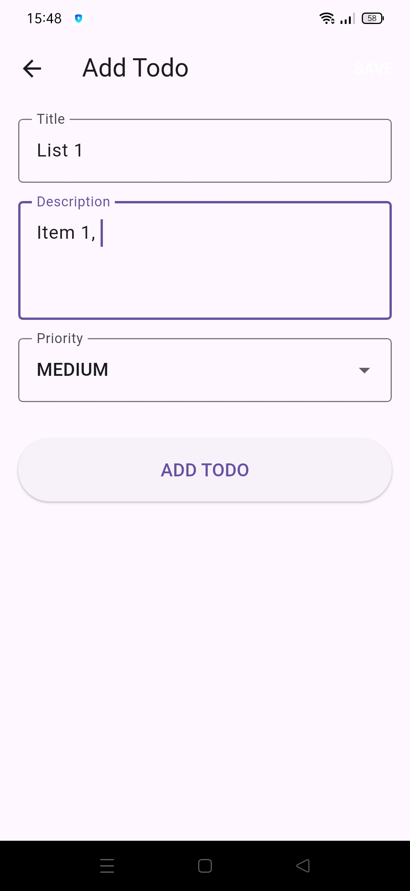
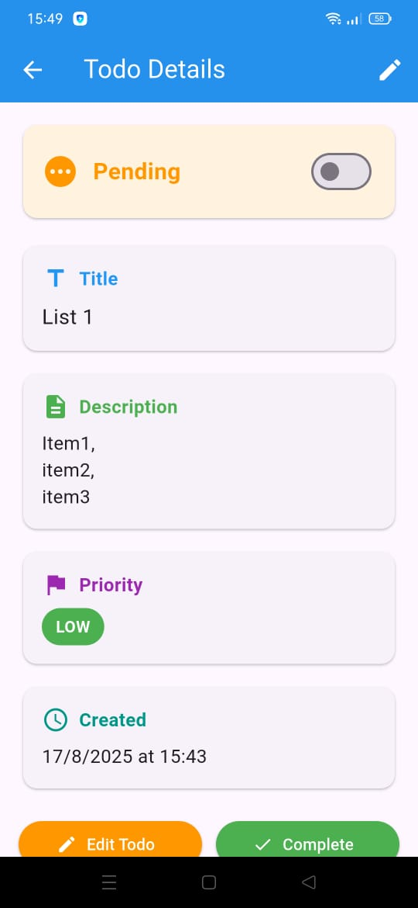

# ✅ Todo App

A simple and clean **Todo App** built with **Flutter**, featuring **local storage** using the `Provider` state management package and `SharedPreferences`.

---

## 🚀 Features
- Add, edit, and delete tasks
- Mark tasks as complete
- Persistent storage with SharedPreferences
- State management with Provider
- Responsive and clean UI

---

## 📸 Screenshots

| Home Screen                        | Add Task Screen                  | View Task Screen                   |
|------------------------------------|----------------------------------|------------------------------------|
|  |  |   |

> Place your screenshots inside `assets/screenshots/` and update the file names above.

---

## 🛠️ Installation

1. Clone the repository:
   ```bash
   git clone https://github.com/bhupenderParmar/todo_app.git
